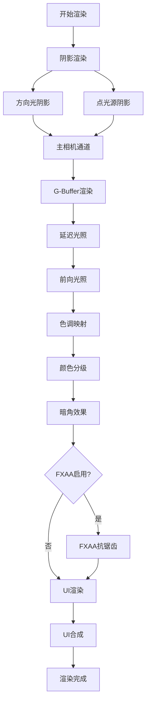
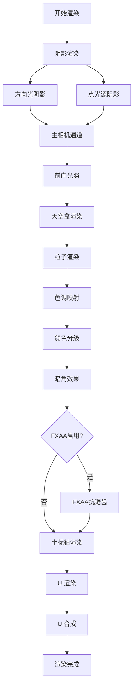
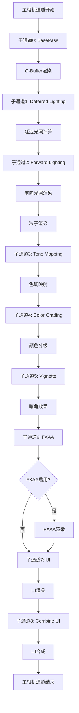
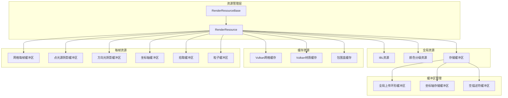
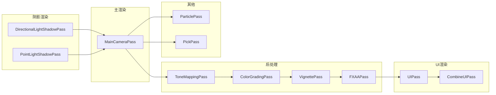
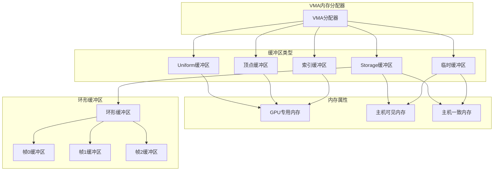
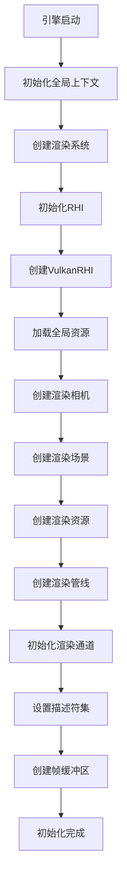
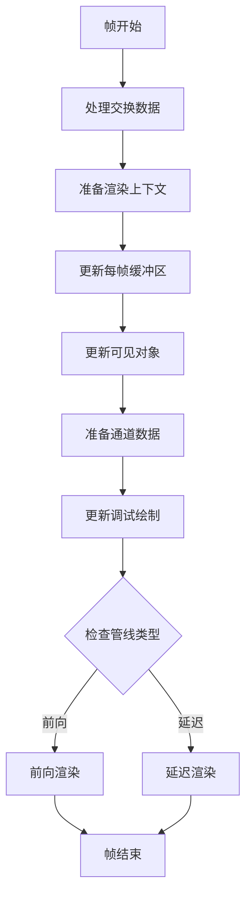

# Piccolo引擎渲染系统架构图

## 系统架构概览

```mermaid
graph TB
    subgraph "引擎层"
        Engine[PiccoloEngine]
        GlobalContext[RuntimeGlobalContext]
    end
    
    subgraph "渲染系统层"
        RenderSystem[RenderSystem]
        RenderSwapContext[RenderSwapContext]
    end
    
    subgraph "渲染管线层"
        RenderPipeline[RenderPipeline]
        ForwardPipeline[ForwardPipeline]
        DeferredPipeline[DeferredPipeline]
    end
    
    subgraph "渲染通道层"
        DirectionalLightPass[DirectionalLightShadowPass]
        PointLightPass[PointLightShadowPass]
        MainCameraPass[MainCameraPass]
        ToneMappingPass[ToneMappingPass]
        ColorGradingPass[ColorGradingPass]
        VignettePass[VignettePass]
        FXAAPass[FXAAPass]
        UIPass[UIPass]
        CombineUIPass[CombineUIPass]
        ParticlePass[ParticlePass]
        PickPass[PickPass]
    end
    
    subgraph "资源管理层"
        RenderResource[RenderResource]
        RenderScene[RenderScene]
        RenderCamera[RenderCamera]
    end
    
    subgraph "硬件抽象层"
        RHI[RHI Interface]
        VulkanRHI[VulkanRHI]
    end
    
    subgraph "其他系统"
        WindowSystem[WindowSystem]
        AssetManager[AssetManager]
        DebugDrawManager[DebugDrawManager]
    end
    
    Engine --> GlobalContext
    GlobalContext --> RenderSystem
    RenderSystem --> RenderSwapContext
    RenderSystem --> RenderPipeline
    RenderSystem --> RenderResource
    RenderSystem --> RenderScene
    RenderSystem --> RenderCamera
    RenderSystem --> RHI
    
    RenderPipeline --> DirectionalLightPass
    RenderPipeline --> PointLightPass
    RenderPipeline --> MainCameraPass
    RenderPipeline --> ToneMappingPass
    RenderPipeline --> ColorGradingPass
    RenderPipeline --> VignettePass
    RenderPipeline --> FXAAPass
    RenderPipeline --> UIPass
    RenderPipeline --> CombineUIPass
    RenderPipeline --> ParticlePass
    RenderPipeline --> PickPass
    
    RHI --> VulkanRHI
    
    RenderSystem --> WindowSystem
    RenderSystem --> AssetManager
    RenderSystem --> DebugDrawManager
```

## 渲染管线流程图

### 延迟渲染管线

### 前向渲染管线

## 主相机通道子通道流程

## 资源管理架构

## 渲染通道依赖关系

## 内存管理架构

## 渲染系统初始化流程

## 每帧渲染流程

这个架构图展示了Piccolo引擎渲染系统的完整结构，包括各个组件之间的关系、数据流向和渲染流程。通过这些图表，可以更清楚地理解渲染系统的工作原理和各个组件的作用。
